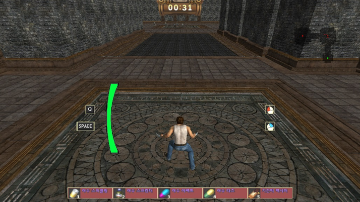
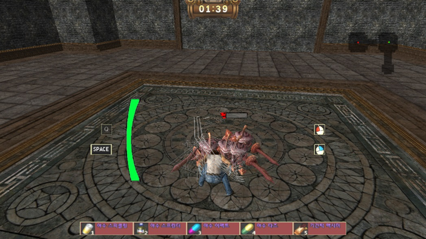
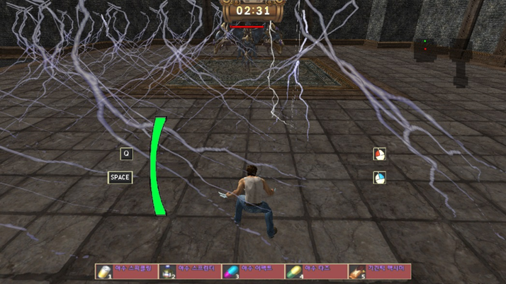
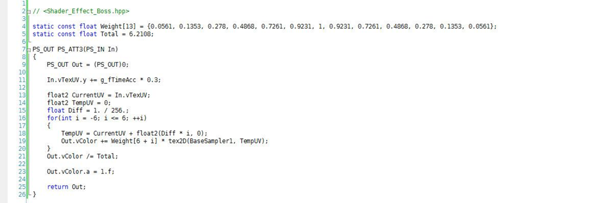
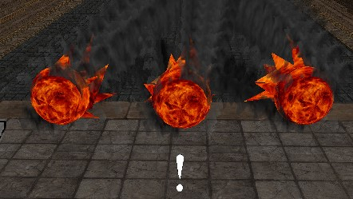
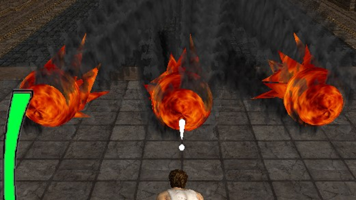
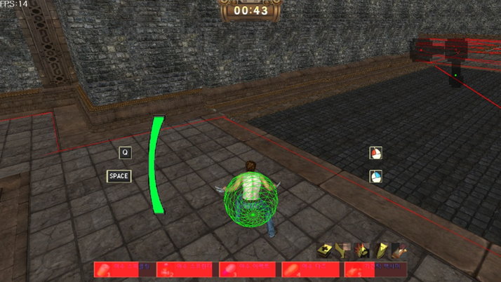
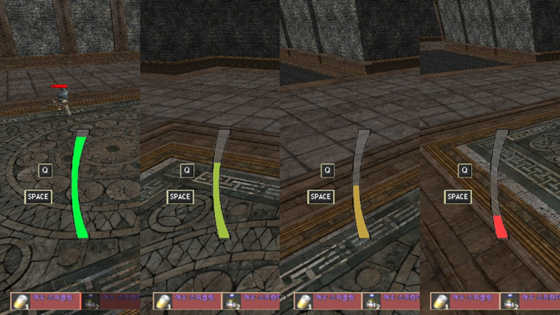
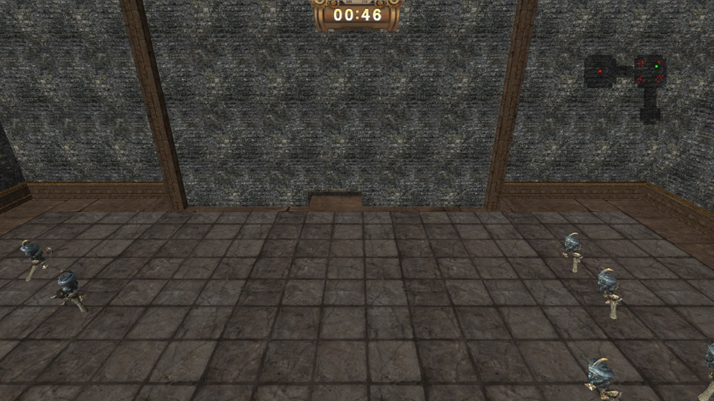

# 울버린

## 게임 소개

  
  
  

창작 3D 액션 게임

- 쉐이더 프로그래밍을 통한 블러 구현
- 기본 쉐이더를 이용한 HP, 쿨타임, 지속시간 UI 구현
- 빌보드 기법
- 네비게이션 메쉬
- 미니맵
- 슬라이딩 벡터

## 핵심 기술

### 쉐이더 프로그래밍을 통한 블러 구현

  
  

### 네비게이션 메쉬, 쉐이더 이용 UI, 미니맵

  
  
  

<!--
  
  
  -->
